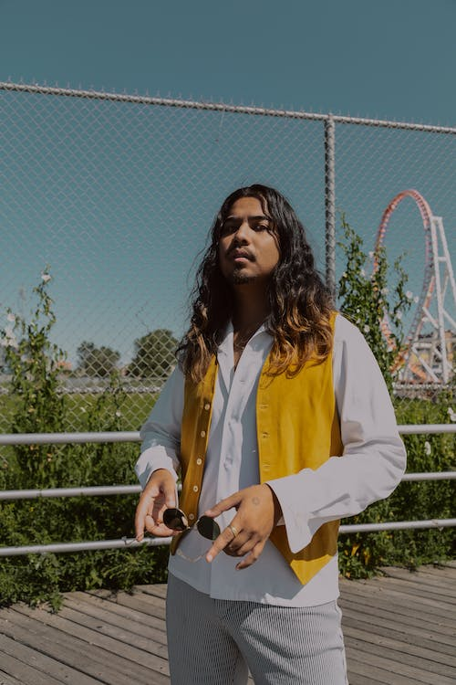

# Especificações do Projeto.

Pré-requisitos: <a href="1-Documentação de Contexto.md"> Documentação de Contexto</a>

A seguir estão apresentadas as personas que foram encontradas durante a pesquisa de resolução e entendimento do problema.

## Personas

| Pedro Junior | Idade: 30 | Persona 1 | 
|:---:|:---:|:---:|
| | **Ocupação:**  Analista em marketing online e fluxo orgânico em uma companhia de design.| **Aplicativos:**  Instagram Facebook LinkedIn YouTube |
| **Marcas Favoritas**| **Frustrações** | **Hobbies e História** |
| Nike, Puma e New Balance | Dificuldade em confiar seus dados a sites de compra online, falta de informação detalhada sobre sneakers nos sites atualmente disponives |  Gosta de acessar foruns de discussão sobre a cultura sneaker na web. Adora fazer a limpeza e conservar suas peças de moda exclusivas|

| Felipe Augusto | Idade: 21 |Persona 2|
|:---:|:---:|:---:|
|  | **Ocupação:** Influenciador Digital| **Aplicativos:** Instagram YouTube Twitter Tiktok |
| **Marcas Favoritas**| **Frustrações**| **Hobbies e História** |
|  Adidas, Vans e Oakley| Ter que preencher repetidamente meu endereço e cartão de credíto em compras online. Cansado de visitar site desatualizado, sem o design pólido | Gosta de estudar sobre a historia e processo da criação do tênis. Por influência de seus artistas preferidos, tambem quer ter um estilo propío desenvolvido |

## Histórias de Usuários

Registramos as histórias das personas encontradas para o projeto e analisamos suas histórias.

|EU COMO... `PERSONA`| QUERO/PRECISO ... `FUNCIONALIDADE` |PARA ... `MOTIVO/VALOR`                 |
|--------------------|------------------------------------|----------------------------------------|
| Pedro Junior |  Desejo ter um espaço para networking com outros entusiastas desse universo sneakerhead     | Para gerar uma troca de informaçoes com pessoas com o gosto semelhante      |
| Pedro Junior | Desejo poder cadastrar e logar uma conta | Para registrar minhas preferências no site |
| Felipe Augusto | Quero mais detelhes a historia do tênis      | Conhecer sobre o criador/marca com mais profundidade     |
| Pedro Junior | Desejo que na página do site tenha o contato para os desenvolvedores do site.       | Para poder comunica-los sobre um possível erro crítico no sistema |
|Pedro Junior | Desejo que tenho uma opção para alterar a senha de login |  Caso eu esqueça     |
| Felipe Augusto |  Desejo ter meus dados de pagamento/endereço salvos com segurança      | Para nao precisar preencher tais informaçoes repetidas vezes  |    
| Felipe Augusto | Gostaria de ver curiosidades sobre o produto que estou comprando no processo de compra | Para ficar mais empolgado e ter mais informaçoes |

## Requisitos

As tabelas que se seguem apresentam os requisitos funcionais e não funcionais que detalham o escopo do projeto.

### Requisitos Funcionais

|ID   | Descrição do Requisito  | Prioridade |
|-----|-----------------------------------------|----|
|RF-01| O site deve fazer a verificação de e-mail no registro de novos usuários e possibilitar o usuário redefinir a senha de login | ALTA | 
|RF-02| O site deve permitir a alteração/consulta dos dados pessoais do usuário   | MÉDIA |
|RF-03| O site deve ter um Fórum de interação entre os usuários. Nessa área, os consumidores poderão interagir sobre os produtos e avalia-los | MÉDIA |
|RF-04| O site deve apresentar informações na tela inicial (imagem ilustrativa, nome e preço ) correspondente ao produto apresentado |ALTA|
|RF-05| O site deve oferecer uma funcionalidade de pesquisa na tela inicial |ALTA|
|RF-06| O site deve oferecer opçoes “Fale Conosco“ “Sobre nós“. Para o usuario ter acesso a comunicação e suporte com a equipe de desenvolvimento/mantedores do site |ALTA|
|RF-07| O site deve ter a função popularmente chamada de "carrinho". Levando o usuário ao final da compra, onde deve acontecer a identificação |ALTA|
|RF-08| O site deve calcular o frete e prazo de entrega do produto |ALTA|
|RF-09| O site deve oferecer curiosidades sobre o tênis na tela de identificaçao(finalizaçao da compra) | BAIXA |

### Requisitos não Funcionais

|ID     | Descrição do Requisito  |Prioridade |
|-------|-------------------------|----|
|RNF-001| O site deve ser compatível com os principais navegadores do mercado (Google Chrome, Firefox, Microsoft Edge) | ALTA | 
|RNF-002| O site deverá ser responsivo permitindo a visualização no ambiente mobile de forma adequada |  ALTA | 
|RNF-003| O site deve ter bom nível de contraste entre os elementos da tela em conformidade |MÉDIA|
|RNF-004| o site deve ser publicado em um ambiente acessível publicamente na Internet (GitHub Pages, Heroku). |ALTA| 

## Restrições

O projeto está restrito pelos itens apresentados na tabela a seguir.

|ID| Restrição                                             |
|--|-------------------------------------------------------|
|01| O projeto deverá ser entregue no final do semestre letivo, na data XX/XX/2023 |
|02| O site deve se restringir a tecnologias básicas da Web no Frontend |
|03| A equipe não deve terceirizar nada em relação ao desenvolvimento do projeto |
