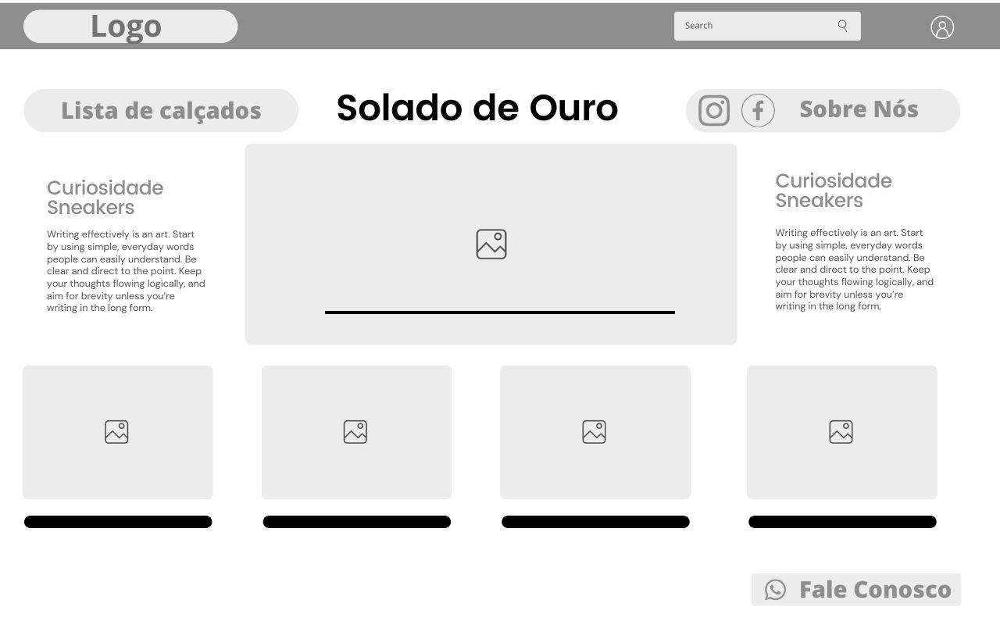
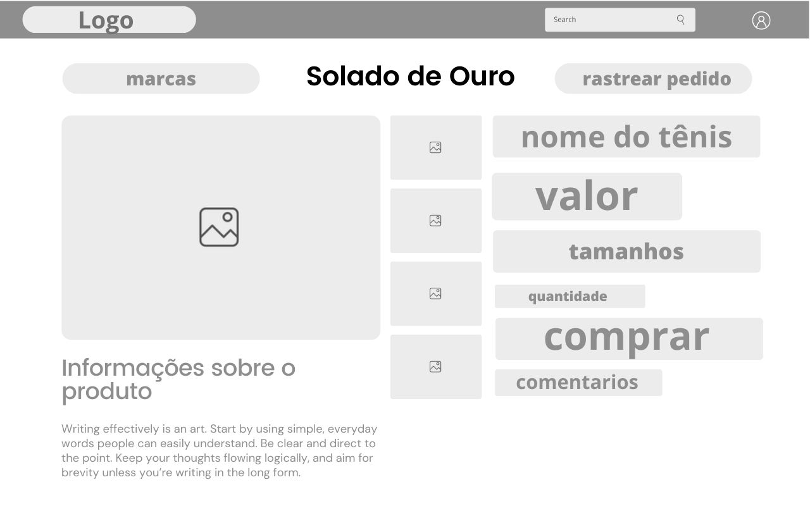
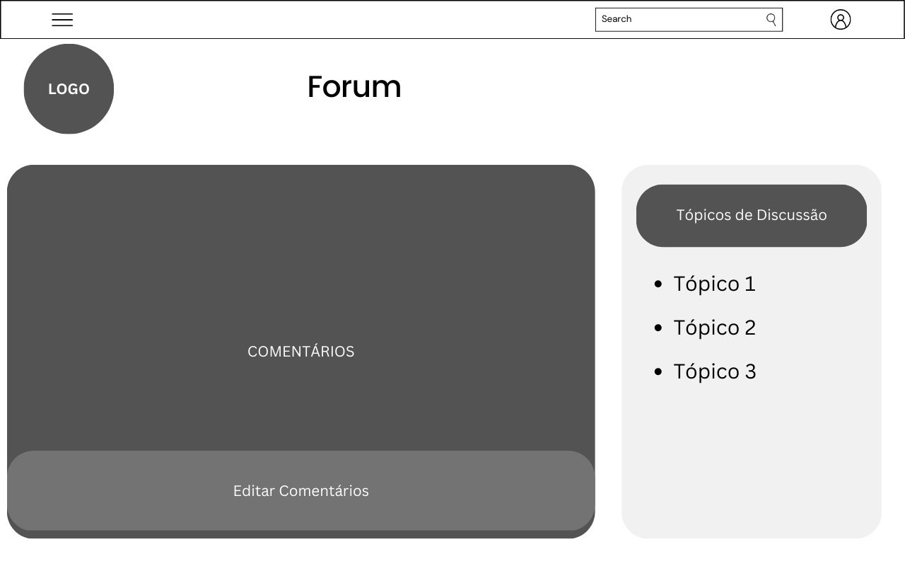

# Projeto de Interface

Pré-requisitos: <a href="2-Especificação do Projeto.md"> Documentação de Especificação</a>

Visão geral da interação do usuário pelas telas do sistema e protótipo interativo das telas com as funcionalidades que fazem parte do sistema (wireframes).

 Apresentamos as principais interfaces da plataforma. Ela foi elaborada de forma a atender os requisitos funcionais, não funcionais e histórias de usuário abordados nas <a href="2-Especificação do Projeto.md"> Documentação de Especificação</a>.

## User Flow
Fluxo de usuário (User Flow) é uma técnica que permite ao desenvolvedor mapear todo fluxo de telas do site ou app. Essa técnica funciona para alinhar os caminhos e as possíveis ações que o usuário pode fazer.

## Wireframes

### Pagina Inicial
A página inicial mostra os tênis mais bem avaliados e os últimos lançamentos, juntamente com um banner apresentando os principais pontos do ecommerce e outros funcionalidades, como o fale conosco e o direcionamento para o fórum de usuários. Ao clicar nos tênis de exibição inicial ou na lista de calçados, será direcionando para a página de compra e informações do tênis.

### Compra
Nessa página será apresentado  todas as informações e curiosidades sobre o tênis, com a opção de compra, numeração e quantidade. O cálculo do frente ficará embaixo da opção de compra, ao lado das fotos do tênis.

### Cadastro/login/Redefinição de Senha

Campos com nome completo, telefone, email e senha. Apos digitar esses dados e verificar o e-mail inserido, o usuário sera levado a tela de login onde deve digitar seu email e senha para entrar na conta.
Tela que permite ao usuário recuperar a senha. Colocando seu e-mail e clicando no botão para gerar o código de verificação que será enviado ao email digitado, com ele o usuário poderá acessar a pagina de alteração da senha de fato.

### Sobre Nós
É um esboço visual básico que representa a estrutura e o layout da página "Sobre Nós" de um site ou aplicativo.
O wireframe pode incluir elementos como o título, uma breve descrição da empresa, informações sobre a equipe, depoimentos de clientes, imagens e links para páginas relacionadas.

### Fórum
O fórum representa a área onde o usuário poderá interagir com outros _sneakerheads_ a respeito dos calçados, curiosidades, e quaisquer tópicos que lhe sejam interessantes.

### Curiosidades Sneakerhead
Uma página destinada a atualizar os usuários sobre as atualidades do estilo de vida _sneakerhead_

### Fale Conosco
O Fale Conosco é bem simples e objetiva, em nosso canto esquerdo e disponibilizado nossos canais de comunicação onde o user consegue ter acesso as informações de Contatos, seja para levar algum elogio ou caso esteja precisando de algo.

